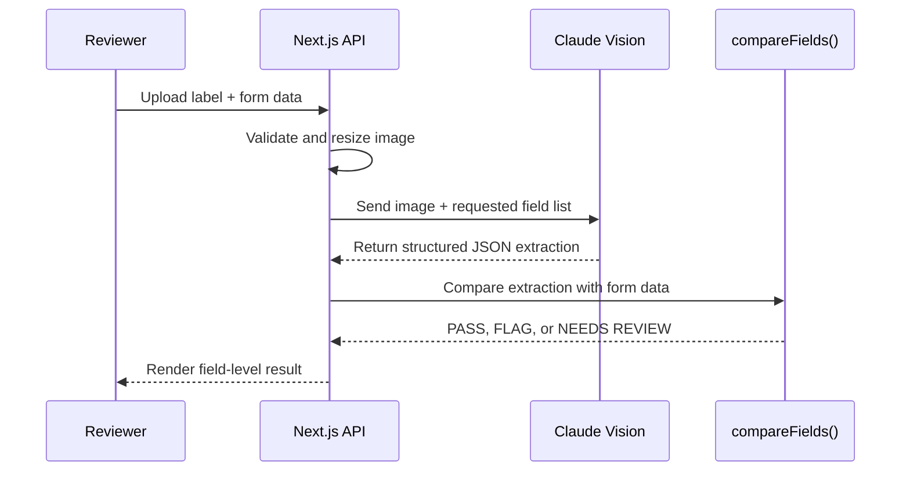

# TTB AI-Powered Label Verification

A Next.js prototype for helping TTB reviewers verify alcohol label artwork against submitted COLA form data.

The app uploads a label image, extracts regulated fields with Claude Vision, then compares the extracted text against form values using deterministic TypeScript logic. The AI only extracts text. It does not make compliance decisions.

## Quick Start

```bash
npm install
npm run dev
```

Open `http://localhost:3000`.

To test without an Anthropic key, use the built-in sample labels from the Quick start menu. When `ANTHROPIC_API_KEY` is not set, the app falls back to `MockProvider` for local development.

## Real AI Setup

Copy the example environment file:

```bash
cp .env.example .env.local
```

Set:

```bash
ANTHROPIC_API_KEY=your_anthropic_api_key_here
ANTHROPIC_MODEL=claude-3-5-sonnet-20241022
```

Restart the dev server after changing environment variables.

If verification returns `503` with "Verification service is temporarily unavailable", check the terminal logs first. Common causes are a missing API key, an unsupported model name, an expired key, account permission errors, rate limits, or upstream provider downtime.

## What The App Supports

- Single label verification at `/`
- Batch verification at `/batch`
- Beverage types: spirits, wine, and beer
- Upload formats: JPG, PNG, and PDF
- Bundled sample labels in `public/test-labels`
- Deterministic PASS, FLAG, and NEEDS REVIEW results
- Field-by-field comparison details
- Mock-provider mode for local demos without external API calls

## Verification Flow



## Standards Followed

- The model extracts label text only; compliance status is computed in code.
- Form data is not sent to the model, so the model cannot bias extraction toward submitted values.
- Field configuration lives in `lib/beverage-fields.ts`.
- Comparison logic lives in `lib/field-comparison.ts`.
- API keys are read server-side only.
- Model responses are parsed and normalized before comparison.
- Missing or malformed AI fields become NEEDS REVIEW instead of silently passing.
- The standard government warning is checked with exact text logic after whitespace normalization.
- Optional fields pass only when both the form and label omit them.

For deeper agent architecture and prompt details, read `AGENTS.md`.

## Test Labels

The app includes 24 JPG labels in `public/test-labels`. They cover pass cases, mismatches, missing warnings, optional ABV behavior, appellation checks, import-country checks, and degraded-image review behavior.

Use the Quick start menu on the single verify page, or click "Seed demo batch" on the batch page.

If you edit label source HTML in `test-labels`, regenerate JPGs with:

```bash
npm run generate-labels
```

## Development Commands

```bash
npm run dev              # Start local dev server
npm run lint             # Run Next.js lint checks
npm run build            # Create production build
npm test                 # Run logic and mock-provider tests
npm run generate-labels  # Rebuild sample label JPGs
```

Run these before calling a change ready:

```bash
npm run lint
npm run build
npm test
```

## Project Layout

```text
app/
  page.tsx              Single label verification UI
  batch/page.tsx        Batch verification UI
  api/verify/route.ts   Single label API route
  api/batch/route.ts    Batch SSE API route

components/             Shared UI components

lib/
  ai-provider.ts        Anthropic and mock extraction providers
  beverage-fields.ts    Field lists and required/optional rules
  field-comparison.ts   Pure comparison and verdict logic
  validation.ts         Server/client form validation helpers
  image-preprocessor.ts Server image resizing
  pdf-preprocessor.ts   Client PDF rasterization

public/test-labels/     Runtime JPG sample labels
test-labels/            Source HTML for generated labels
scripts/                Label generation and test utilities
AGENTS.md               Detailed agent architecture
```

## Deployment

This app can run on Vercel, Render, or any Node-compatible host.

Required production settings:

- Node.js 20
- `ANTHROPIC_API_KEY`
- `ANTHROPIC_MODEL`

Build and start:

```bash
npm install
npm run build
npm start
```

Batch processing uses server-sent events and concurrent AI requests. For larger batches, prefer a deployment target with enough function duration and provider rate-limit headroom.

## Reviewer Notes

This is a prototype, not an official TTB compliance system. It is designed to demonstrate a safe architecture:

- AI extraction is isolated from compliance judgment.
- Deterministic code owns all result statuses.
- Reviewers get transparent field-level reasons.
- Uncertainty is surfaced as NEEDS REVIEW.

When evaluating the project, start with the bundled sample labels, then test one real label with a valid Anthropic key.
